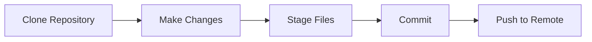
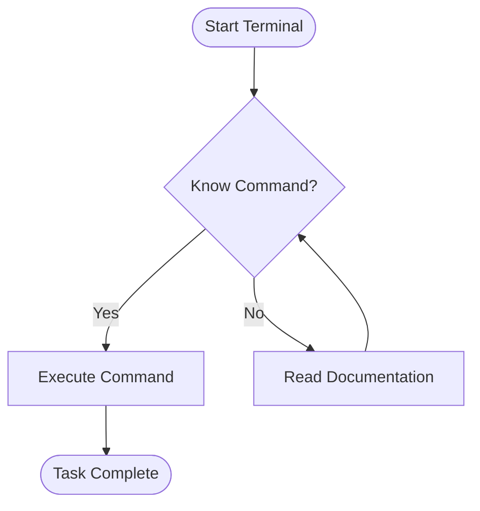
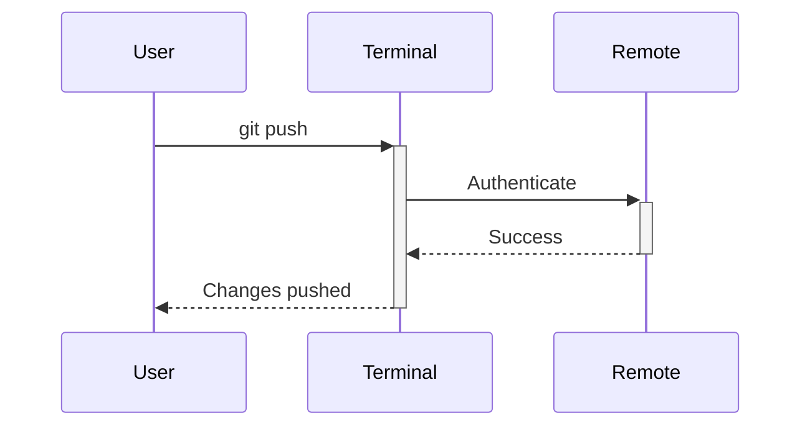

# The Terminal Archives

<div class="stamp-box">Status: Active</div>
<div class="stamp-box">Clearance: Level 1</div>

Welcome to **The Terminal Archives** — your comprehensive guide to mastering the command line interface and Git version control.

---

## Text Formatting

You can make text **bold**, *italic*, or ***both***. You can also use ~~strikethrough~~ and ==highlight== text.

Use `inline code` for commands, or create subscript~text~ and superscript^text^.

## Lists

### Unordered List

- First item
- Second item
    - Nested item 1
    - Nested item 2
- Third item

### Ordered List

1. First step
2. Second step
    1. Sub-step A
    2. Sub-step B
3. Third step

### Task List

- [x] Learn basic shell commands
- [x] Understand file permissions
- [ ] Master Git workflows
- [ ] Deploy with CI/CD

## Admonitions

!!! note "Operational Context"
    The commands listed in this archive are powerful. Ensure you are working within designated training environments.

!!! warning "Security Alert"
    Never run `rm -rf /` or similar destructive commands without understanding their impact.

!!! tip "Pro Tip"
    Use `Tab` completion to speed up your command entry and reduce typos.

!!! abstract "Summary"
    This section covers fundamental concepts that form the foundation of terminal usage.

!!! info "Information"
    You can customize your shell prompt by modifying the `PS1` environment variable.

!!! success "Checkpoint Reached"
    You've completed the basics! Ready to move to advanced topics.

!!! question "Common Question"
    **Q:** What's the difference between `cd ~` and `cd /`?
    **A:** `~` is your home directory, `/` is the root of the filesystem.

!!! danger "Critical Warning"
    Modifying system files without proper knowledge can break your system.

!!! bug "Known Issue"
    Some commands behave differently between Linux and macOS. Always check documentation.

??? example "Expandable Example"
    This content is hidden by default. Click to expand.

    ```bash
    ls -la
    cd ~/Documents
    mkdir new_folder
    ```

## Code Blocks

### Basic Code Block

```bash
cd /home/user
ls -lah
git status
```

### With Line Numbers

```python linenums="1"
def hello_world():
    print("Hello, Terminal Archives!")

if __name__ == "__main__":
    hello_world()
```

### With Highlighting

```bash hl_lines="2 3"
cd ~/projects
git add .
git commit -m "Initial commit"
git push origin main
```

### With Title

```javascript title="config.js"
module.exports = {
  port: 3000,
  debug: true
};
```

### Inline Code Highlighting

The `#!python range()` function is useful, and `#!bash git status` shows repository state.

## Tabs

=== "Linux"

    ```bash
    sudo apt update
    sudo apt install git
    ```

=== "macOS"

    ```bash
    brew update
    brew install git
    ```

=== "Windows"

    ```powershell
    winget install Git.Git
    ```

## Tables

| Command | Description | Example |
|---------|-------------|---------|
| `ls` | List directory contents | `ls -la` |
| `cd` | Change directory | `cd /home` |
| `pwd` | Print working directory | `pwd` |
| `mkdir` | Make directory | `mkdir folder` |
| `rm` | Remove files | `rm file.txt` |

## Keyboard Keys

Press ++ctrl+c++ to cancel a command. ++shift++

Use ++ctrl+shift+t++ to open a new terminal tab.

Navigate with ++arrow-up++ and ++arrow-down++ through command history.

## Footnotes

Here's a sentence with a footnote[^1].

[^1]: This is the footnote content. It will appear at the bottom of the page.

## Abbreviations

The HTML specification is maintained by the W3C.

*[HTML]: Hyper Text Markup Language
*[W3C]: World Wide Web Consortium

## Links and Buttons

[External Link](https://github.com){ .md-button }

[Primary Button](module1/01_intro.md){ .md-button .md-button--primary }

## Images


## Blockquotes

> "Any sufficiently advanced technology is indistinguishable from magic."
>
> — Arthur C. Clarke

## Definition Lists

`cd`
:   Change the current directory

`ls`
:   List directory contents

`git`
:   Distributed version control system

## Math (if needed)

Inline math: $E = mc^2$

Block math:

$$
\frac{n!}{k!(n-k)!} = \binom{n}{k}
$$

## Mermaid Diagrams



## Flow Chart



## Sequence Diagram



---

## Core Training Modules

### Part I: The Shell

Master file system navigation and manipulation.

- **Navigation:** `cd`, `ls`, `pwd`
- **File Operations:** `cp`, `mv`, `rm`, `touch`
- **Permissions:** `chmod`, `chown`
- **Search:** `find`, `grep`

### Part II: Git Version Control

Learn to track changes and collaborate.

- **Basic Operations:** `init`, `add`, `commit`
- **Branching:** `branch`, `checkout`, `merge`
- **Remote Operations:** `push`, `pull`, `fetch`
- **Advanced:** `rebase`, `cherry-pick`, `stash`

---

## Case Files

!!! note "Subject: Count Dracula"
    **Classification:** Porphyric Hemophage
    **Status:** Active Threat
    **Last Seen:** <span class="redacted">Transylvania Region</span>

!!! warning "Urgent Alert"
    Do not engage without proper equipment. Silver weapons required.

!!! abstract "Field Report"
    Target observed heading westbound at 2300 hours.

---

## Getting Started

Ready to begin your training?

[Start Module 1: Shell Basics](module1/01_intro.md){ .md-button .md-button--primary }

---

*Authorized Personnel Only. Document Classification: <span class="redacted">Level 3</span>*

<span class="evidence">A-47</span>

<div class="case-file">
### Case #1984-A
Victim: John Doe
Location: <span class="redacted">Baker Street</span>
</div>

<div class="tape">
    <div class="handwritten">
    Detective's note: Subject was last seen at 11:45 PM...
    </div>
</div>

<div class="timeline">
<p class="timeline-date">23:45 - November 12</p>
<p>Last known sighting of victim</p>
</div>

<div class="police-tape">⚠ Crime Scene - Do Not Cross ⚠</div>

<div class="tape">
    <div class="witness">
    "I heard a scream around midnight, then footsteps running away..." - Mrs. Henderson
    </div>
</div>

<div class="blood-warning">
  **CAUTION:** Biological evidence found at scene. Handle with extreme care.
</div>

<div class="suspect">
  
  <div class="suspect-name">John Doe - Prime Suspect</div>
</div>
